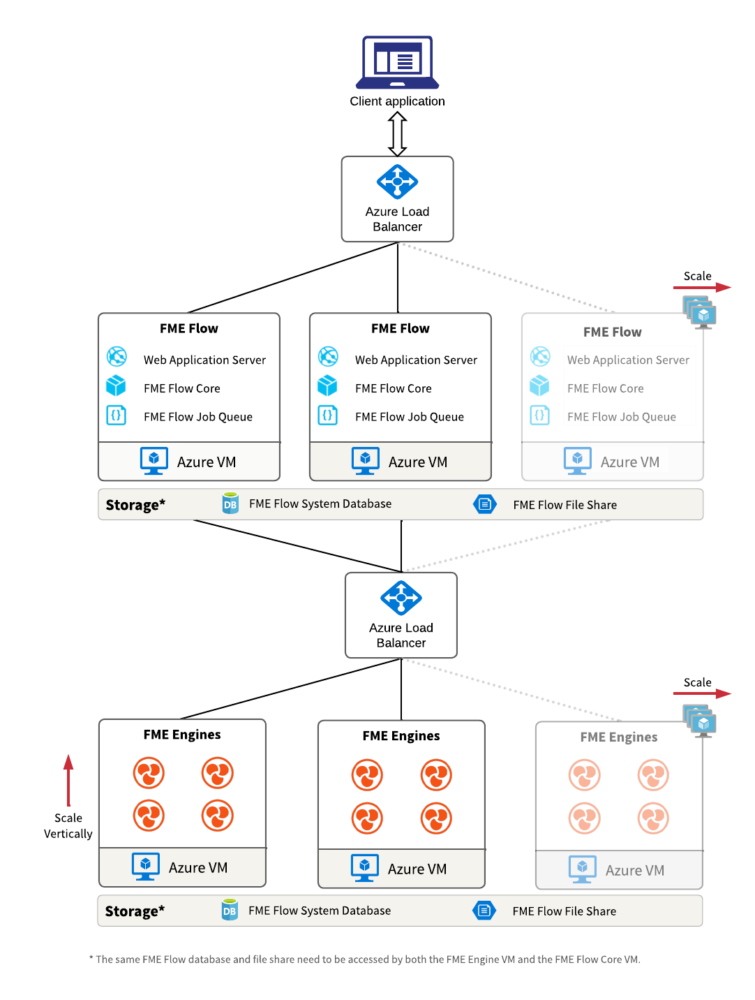

# FME Flow (Distributed deployment, Windows)

These terraform scripts deploy [FME Flow (Distributed deployment, Windows)](https://azuremarketplace.microsoft.com/en-US/marketplace/apps/safesoftwareinc.fme-server-distributed-deployment?tab=overview) in your Azure Subscription. The scripts can be used as a boilerplate for automatic deployments of the public FME Flow Azure VM images in your own environment with your own configurations. The terraform scripts are split up into multiple modules to reflect the distributed architecture and to simplify modification of the resources for different scenarios.

# How to use the scripts
## Quickstart
### Prerequisites

To deploy FME Flow (Distributed deployment, Windows) on Microsoft Azure from a local machine, the Azure CLI and terraform need to be installed, configured and terraform needs to be authenticated to Azure. Follow this documentation depending on your scenario: [Quickstart: Install and Configure Terraform](https://docs.microsoft.com/en-us/azure/developer/terraform/quickstart-configure)

### Apply the deployment

Once all prerequisites are installed you confirmed that terraform successfully authenticated to Azure the terraform scripts can be deployed via the following steps

1. Review the `variables.tf` file. This file contains all variables for the deployment. Most of the variables have default values assigned, but can be changed in the `.tf` file or overridden by using the `-var` flag with the `terraform apply` command. You will be prompted for any variable that does not have a default after running the `terraform apply` command.
2. Run `terraform apply` in your console from the directory that that holds the `main.tf` and `variables.tf` file and provide any variables you are prompted for.
3. Review the deployment plan. If the terraform script and the provided variables validated successfully the deployment plan will be output in the consoled for you to review. Additionally you will be prompted wether you want to go ahead with the deployment. If everything looks ok, go ahead with `yes`. The deployment will now provision and configure all necessary Azure resources and start up FME Flow. This will take about 10 - 20 minutes.
4. In this quickstart example the terraform statefile `terraform.tfsate` will be created on on your local machine, so you can review the current state of your deployment and test the deployment. For any productive deployments it is highly recommended to not store the state file locally but in a remote location. This makes sure you can collaborate on the state and any sensitive data contained in the state file will only be accessible to authorized users. To use Azure storage as a backend for your statefile follow this documentation: [Azure storage terraform backend](https://www.terraform.io/language/settings/backends/azurerm)

### Test FME Flow

Once the deployment is complete it is time to test FME Flow. The public URL for the new FME Flow can be found in the overview of the Application Gateway resource. Follow these steps to test FME Flow:
1. [Log on to the Web User Interface](https://docs.safe.com/fme/html/FME_Server_Documentation/AdminGuide/Log-on-Get-Started-2-Tier.htm)
2. [Request and Install a License](https://docs.safe.com/fme/html/FME_Server_Documentation/AdminGuide/Request_and_Install_a_License-2-Tier.htm)
3. [Run Workspace](https://docs.safe.com/fme/html/FME_Server_Documentation/WebUI/Run-Workspace.htm?)

### Delete the deployment

To remove the FME Flow deployment run `terrform destroy` in your console and confirm the prompt with `yes`.
<!-- BEGIN_TF_DOCS -->
## Requirements

| Name | Version |
|------|---------|
|  [terraform](#requirement\_terraform) | >= 1.1.0 |
|  [azurerm](#requirement\_azurerm) | ~> 3.9.0 |

## Providers

| Name | Version |
|------|---------|
|  [azurerm](#provider\_azurerm) | 3.9.0 |

## Modules

| Name | Source | Version |
|------|--------|---------|
|  [application\_gateway](#module\_application\_gateway) | ./modules/lb-services/agw | n/a |
|  [database](#module\_database) | ./modules/database/pgsql | n/a |
|  [load\_balancer](#module\_load\_balancer) | ./modules/lb-services/lb | n/a |
|  [network](#module\_network) | ./modules/network | n/a |
|  [storage](#module\_storage) | ./modules/storage | n/a |
|  [vmss\_core](#module\_vmss\_core) | ./modules/vmss/vmss_core | n/a |
|  [vmss\_cpuusage\_engine](#module\_vmss\_cpuusage\_engine) | ./modules/vmss/vmss_engine | n/a |
|  [vmss\_standard\_engine](#module\_vmss\_standard\_engine) | ./modules/vmss/vmss_engine | n/a |

## Resources

| Name | Type |
|------|------|
| [azurerm_resource_group.fme_flow](https://registry.terraform.io/providers/hashicorp/azurerm/latest/docs/resources/resource_group) | resource |

## Inputs

| Name | Description | Type | Default | Required |
|------|-------------|------|---------|:--------:|
|  [agw\_name](#input\_agw\_name) | Application gateway name | `string` | `"fme-flow-agw"` | no |
|  [agw\_snet\_name](#input\_agw\_snet\_name) | Application gateway virtual network subnet name | `string` | `"fme-flow-agw-snet"` | no |
|  [be\_snet\_name](#input\_be\_snet\_name) | Backend virtual network subnet name | `string` | `"fme-flow-be-snet"` | no |
|  [build\_agent\_public\_ip](#input\_build\_agent\_public\_ip) | Public IP of the build agent or machine that is running terraform deployment to be whitelisted in the storage account. This is a workaround for the following known issue: https://github.com/hashicorp/terraform-provider-azurerm/issues/2977 | `string` | n/a | yes |
|  [db\_admin\_pw](#input\_db\_admin\_pw) | Specifies the backend database admin pw. This variable should be retrieved from an [environment variable](https://www.terraform.io/cli/config/environment-variables#tf_var_name) or a secure secret store like [Azure Key Vault](https://registry.terraform.io/providers/hashicorp/azurerm/latest/docs/data-sources/key_vault). DO NOT HARDCODE. | `string` | n/a | yes |
|  [db\_admin\_user](#input\_db\_admin\_user) | Specifies the backend database admin username. This variable should be retrieved from an [environment variable](https://www.terraform.io/cli/config/environment-variables#tf_var_name) or a secure secret store like [Azure Key Vault](https://registry.terraform.io/providers/hashicorp/azurerm/latest/docs/data-sources/key_vault). DO NOT HARDCODE. | `string` | n/a | yes |
|  [db\_pw](#input\_db\_pw) | The password for the fmeflow database (Only used for Azure SQL Server. Should be left blank when PostgreSQL is used). Please review the [SQL Server Password Policy](https://docs.microsoft.com/en-us/sql/relational-databases/security/password-policy?view=azuresqldb-current)). This variable should be retrieved from an [environment variable](https://www.terraform.io/cli/config/environment-variables#tf_var_name) or a secure secret store like [Azure Key Vault](https://registry.terraform.io/providers/hashicorp/azurerm/latest/docs/data-sources/key_vault). DO NOT HARDCODE. | `string` | n/a | yes |
|  [db\_user](#input\_db\_user) | The login for the fmeflow database (Only used for Azure SQL Server. Should be left blank when PostgreSQL is used). This variable should be retrieved from an [environment variable](https://www.terraform.io/cli/config/environment-variables#tf_var_name) or a secure secret store like [Azure Key Vault](https://registry.terraform.io/providers/hashicorp/azurerm/latest/docs/data-sources/key_vault). DO NOT HARDCODE. | `string` | n/a | yes |
|  [domain\_name\_label](#input\_domain\_name\_label) | Label for the Domain Name. Will be used to make up the FQDN | `string` | `"fmeflow"` | no |
|  [instance\_count\_core](#input\_instance\_count\_core) | Number of Core VM instances | `number` | `2` | no |
|  [instance\_count\_engine](#input\_instance\_count\_engine) | Number of engine VM instances | `number` | `2` | no |
|  [lb\_name](#input\_lb\_name) | Load balancer name | `string` | `"fme-flow-lb"` | no |
|  [location](#input\_location) | Location of resources | `string` | `"Canada Central"` | no |
|  [owner](#input\_owner) | Default value for onwer tag | `string` | n/a | yes |
|  [pip\_name](#input\_pip\_name) | Public ip name | `string` | `"fme-flow-pip"` | no |
|  [rg\_name](#input\_rg\_name) | Resource group name | `string` | `"terraform-rg"` | no |
|  [vm\_admin\_pw](#input\_vm\_admin\_pw) | Specifies the windows virual machine admin pw. Password must have 3 of the following: 1 lower case character, 1 upper case character, 1 number, and 1 special character. The value must be between 12 and 123 characters long. This variable should be retrieved from an [environment variable](https://www.terraform.io/cli/config/environment-variables#tf_var_name) or a secure secret store like [Azure Key Vault](https://registry.terraform.io/providers/hashicorp/azurerm/latest/docs/data-sources/key_vault). DO NOT HARDCODE. | `string` | n/a | yes |
|  [vm\_admin\_user](#input\_vm\_admin\_user) | Specifies the windows virual machine admin username. This variable should be retrieved from an [environment variable](https://www.terraform.io/cli/config/environment-variables#tf_var_name) or a secure secret store like [Azure Key Vault](https://registry.terraform.io/providers/hashicorp/azurerm/latest/docs/data-sources/key_vault). DO NOT HARDCODE. | `string` | n/a | yes |
|  [vnet\_name](#input\_vnet\_name) | Virtual network name | `string` | `"fme-flow-vnet"` | no |

## Outputs

| Name | Description |
|------|-------------|
|  [fme\_server\_fqdn](#output\_fme\_server\_fqdn) | External hostname of FME Flow |
<!-- END_TF_DOCS --> 
## Modifying resources
The terraform scripts provide an easy way to read and modify the configuration.
### Changing Resource configurations
Most of the default resource configurations follow the minimum of the recommended machine specifications for FME Flow. However for demanding workflows it is recommended to scale the the resources accordingly. With terraform it is easy to scale the resources by just updating the configuration (e.g. for the virtual machine scale sets of the core and engine) and rerun the `terraform apply` command.
### Changing backend DB configuration
#### Use Azure SQL
A Azure SQL Server database as the FME Sever backend database can be used by changing the the module source of the database module to `./modules/database/sql_server` in the `main.tf` file. Additionally the default PowerShell script on the core virtual machine scale set (VMSS) needs to be overridden with the script provided in `./modules/database/sql_server/script`. To do this the `custom_data` property of the core VMSS can be used to upload the file and a new extension property of the core VMSS that runs the new script instead of the default script can be added. This change is already prepared in the `main.tf` file and only requires uncommenting/commenting of the respective sections in the database and the core VMSS modules.
#### Use existing database
The most important prerequisite to use an existing database with the distributed FME Flow deployment is network connectivity between the database and the backend VNet that is created for the FME Flow deployment. There are different ways to accomplish this. In the default configuration a network rule is added to the database server that is used. To use an existing Azure SQL or PostgreSQL database the exising resources can be [imported](https://www.terraform.io/cli/import) into the terraform configuration. This way the existing resources and any changes to them can also be managed be by terraform. Another option is to only provide the necessary variables in the `variables.tf` to make sure the FME core and engines can connect to the database.
## Architecture Diagram
See below for an architecture diagram of the deployment in Azure. There are some details not shown on the diagram, such as the virtual networks and secrets. This diagram also shows only one scaling group for FME Engines, though the deployment actually has two separate scaling groups for engines: One for standard engines and one for CPU engines. Otherwise those scaling groups are identical.

# Todo
- create NSGs
- (optional) create NAT gateway for explicit outbound traffic of VMs: [Default outbound access in Azure](https://learn.microsoft.com/en-us/azure/virtual-network/ip-services/default-outbound-access)