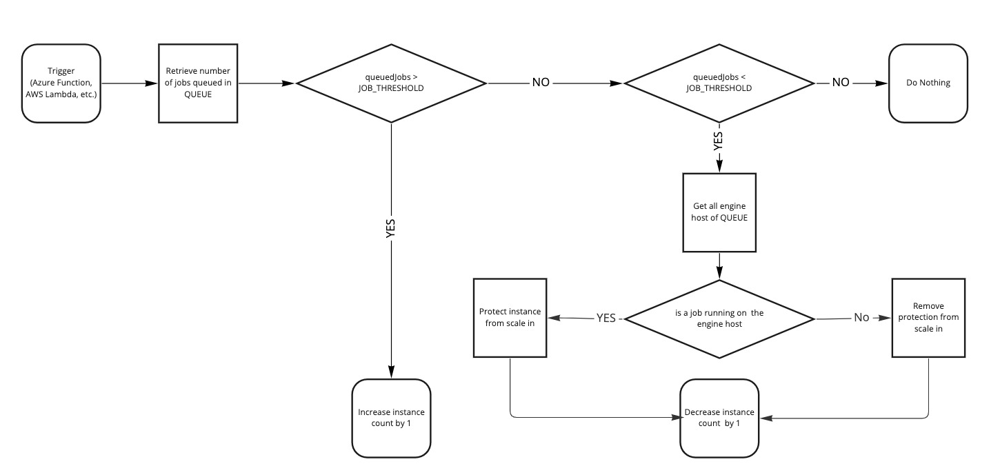
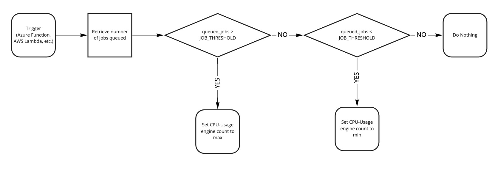

# Examples for scaling CPU-Usage (Dynamic) FME Server Engines
The scaling examples showcase a proof of concept to scale CPU-Usage (Dynamic) FME Server Engines based on queued jobs in Azure and AWS with python. These examples can be a starting point for an Azure Function and AWS Lambda implementation supporting different scaling scenarios.

## How to use the scripts
The scripts depend on modules specified in the docstrings of each script. Additionally environment variables need to be set to authenticate with FME Server and the respective cloud service provider.

### Scaling engine hosts
The scripts for scaling multiple hosts follow this steps:

#### Scale CPU-Usage engines with AWS Auto Scaling Group (scaleAwsAsg.py)
This example shows potential methods that can be used to scale AWS Auto Scaling Groups using the scale-in protection feature. The metric to scale in and out is an specified queued job threshold. To identify instances to protect, the engine hosts running jobs are queried via the FME Server REST API.  

#### Scale CPU-Usage engines with Azure Virtual Machine Scale Sets (scaleAzureVmss.py)
#### Job submission to engine shutting down
While the scale-in protection functionality of AWS ASG and Azure VMSS prevent the cancellation of jobs actively running it does not guard against jobs being submitted to engines that are in the middle of shutting down. This might be a rare scenario and depending on the use case this might not be an concern. One way to guard against this is to activate failed resubmission of failed jobs in FME Server. This way any job that might be canceled, because it was accidentialy submitted to a host hat is shutting down, the job will be added to the queue again to be processed by a different engine.

### Scale CPU-Usage engines with on a single existing FME Server Engine host
This example it only utilizing the FME Server REST API and scale CPU-Usage engines either up to a specified maximum value or down to a minimum value. The metric to scale in and out is an specified queued job threshold.

